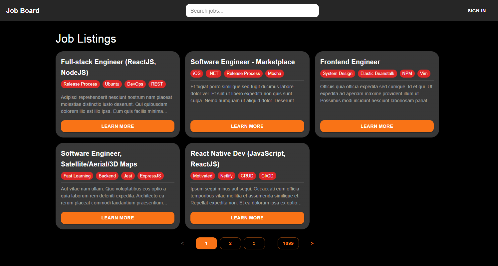

# Job Board 📋 (React + MUI v7 + React Router v7)

[](https://jobboard-app.netlify.app/)


A responsive **Job Board** web app built with **React + MUI v7 + React Router v7**.

> This project simulates a job board to practice React Router advanced patterns and MUI UI building:
>
> - Modal routing with background location
> - Fake authentication and redirect flow
> - Search + pagination UX

---

## 📌 About

This project has reached **v1.0.0 stable release** 🎉.  
It includes a feature-based architecture, authentication (fake login), job listings with pagination, search, and modal routing.  
Backend powered by **json-server** (Render) and frontend deployed on **Netlify**.

---

## ✨ Features

- Fetch jobs from mock API (`json-server` hosted on Render).
- Job list with **pagination** (5 per page).
- **Authentication**: fake login (`admin/demo123`).
- If unauthenticated → clicking a job opens **LoginModal** (via route).
- **Login route `/login`** with redirect back to the previous page.
- **Search bar in Navbar** to filter jobs by title/description.
- **Job detail modal overlay** using background routing.
- Custom **dark theme** with MUI overrides.
- Responsive grid layout (mobile → desktop).

---

## 🖼️ Screenshot



---

## 🛠 Tech Stack

- **Frontend**: React 19, React Router v7, MUI v7
- **Backend (mock)**: json-server
- **HTTP Client**: axios
- **Deploy**: Netlify (frontend) + Render (mock API)

---

## 📂 Project Structure (Feature-based)

```
src/
 ├── app/
 │   ├── api/
 │   │   ├── apiService.js     # axios instance
 │   │   └── axiosConfig.js    # axios baseURL config
 │   ├── contexts/
 │   │   └── AuthContext.js    # global authentication context
 │   ├── constants.js          # global constants (e.g. JOBS_PER_PAGE)
 │   └── theme.js              # MUI theme config
 ├── features/
 │   ├── jobs/
 │   │   ├── Jobs.js
 │   │   ├── JobDetail.js
 │   │   └── JobDetailModal.js
 │   └── auth/
 │       └── LoginModal.js
 ├── components/
 │   ├── Navbar.js
 │   ├── Layout.js
 │   └── JobCard.js
 ├── App.js
 └── index.js
```

---

## 🚀 Getting Started

```bash
# Clone repo
git clone https://github.com/kiettt23/job-board.git
cd job-board

# Install deps
npm install

# Start mock API
npm run dev:api
# → http://localhost:4000/jobs

# Start React app
npm start
# → http://localhost:3000
```

**Login credentials**

- Username: `admin`
- Password: `demo123`

---

## 📅 Roadmap

### ✅ Completed

- v0.1.0: Job list + detail modal (API)
- v0.2.0: Pagination + AuthContext
- v0.2.1: Global login modal
- v0.3.0: Search job (title/description)
- v0.3.1: Move search bar to Navbar
- v0.4.0: Map LoginModal to `/login` route + redirect flow
- v1.0.0: **Stable release** with feature-based architecture, auth, search, and modal routing

### 🔜 Planned

- v1.1.0: **Server-side pagination** with `/jobs?_page=&_limit=`
- v1.2.0: Dark/light theme toggle
- v1.3.0: Improve JobDetail (city, salary, postedDate)
- v1.4.0: CI/CD pipeline (Netlify + Render)
- v1.5.0: Unit tests (Jest + RTL)

---

## 📝 Working Rules

- **Architecture**: feature-based for scalability and clarity.
- **Code style**: sectioned comments (`// -------------------- State --------------------`) to improve readability.
- **Workflow**: setup → code → debug → deploy.
- **Commit**: follow convention (`feat`, `fix`, `refactor`, `docs`, `style`, `chore`).
- **Debug**: read logs, isolate bug, understand before using AI.
- **Docs**: README clear, with setup & demo link.
- **Repo**: clean (gitignore, no junk files).

---

## 📜 License

MIT — see [LICENSE](./LICENSE).
